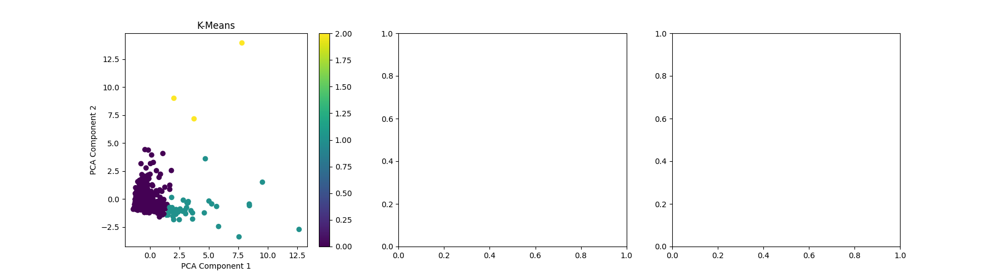
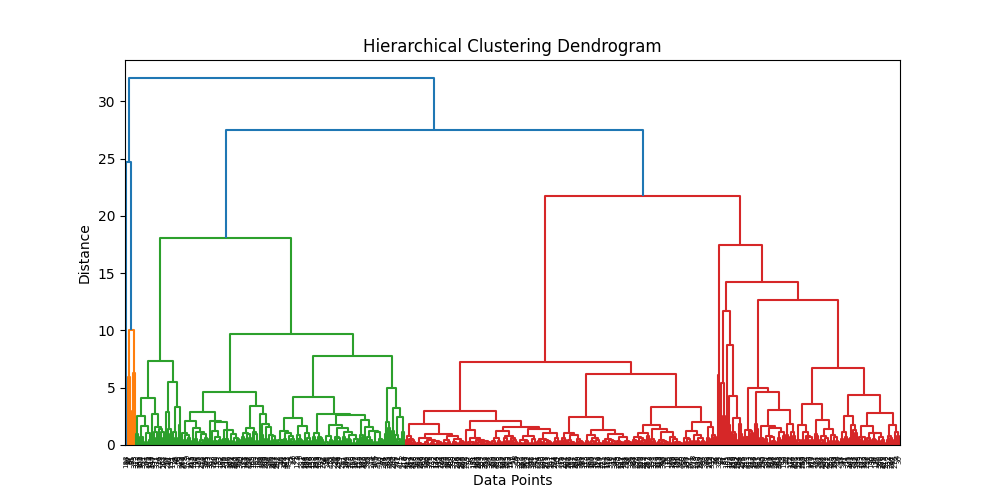

# Clustering Analysis

## Overview
This project performs a comparative study of different clustering algorithms on the "Wholesale Customers Data" from the UCI Machine Learning Repository. The algorithms analyzed include:
- **K-Means Clustering**
- **Hierarchical Clustering**
- **Mean-Shift Clustering**

Different preprocessing techniques are applied, including:
- No Data Processing
- Normalization
- Power Transformation
- PCA (Principal Component Analysis)

## Dataset
The dataset is sourced from:
[UCI Machine Learning Repository - Wholesale Customers Data](https://archive.ics.uci.edu/ml/machine-learning-databases/00292/Wholesale%20customers%20data.csv)

The dataset includes attributes such as Fresh, Milk, Grocery, Frozen, Detergents_Paper, and Delicassen.

## Implementation
### Preprocessing Techniques:
- **Standard Scaling**: Normalizes the data to have a mean of 0 and standard deviation of 1.
- **Power Transformation**: Applies power transformation to make the data more Gaussian-like.
- **PCA (Principal Component Analysis)**: Reduces dimensions while preserving variance.

### Evaluation Metrics:
The clustering performance is evaluated using:
1. **Silhouette Score**: Measures how similar each point is to its own cluster compared to other clusters.
2. **Calinski-Harabasz Score**: Measures the ratio of between-cluster variance to within-cluster variance.
3. **Davies-Bouldin Score**: Measures the average similarity ratio between clusters (lower is better).

### Outputs:
The results are saved as:
- **clustering_results.csv**: A table containing the evaluation metrics for each algorithm and preprocessing technique.
- **Cluster Visualizations**: Each clustering algorithm's results are saved as images (e.g., `K-Means_clusters.png`, `Hierarchical_clusters.png`, `Mean-Shift_clusters.png`).
- **Dendrogram**: A hierarchical clustering dendrogram saved as `dendrogram.png`.
- **Performance Comparison Table**: The comparison table summarizing the results.

### Example Graphs:
Below are some sample visualizations from the analysis:

#### K-Means Clustering Visualization


#### Hierarchical Clustering Dendrogram


## Usage
### Running the Code
1. Install dependencies:
   ```sh
   pip install numpy pandas matplotlib seaborn scikit-learn
   ```
2. Run the script:
   ```sh
   python clustering_analysis.py
   ```
3. Check the output files:
   - `clustering_results.csv`
   - Cluster visualization images
   - `dendrogram.png`

## Conclusion
This project provides an analysis of how different clustering techniques perform under various preprocessing methods. The best-performing clustering method depends on the chosen evaluation metric and dataset characteristics.

